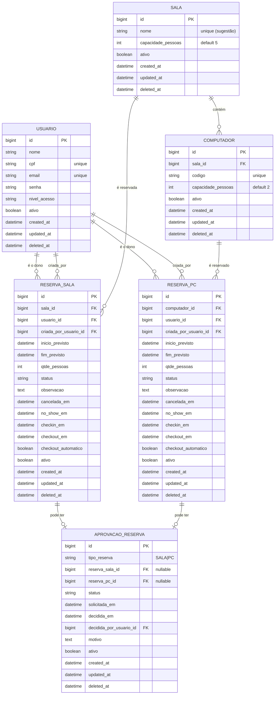

# Modelagem de Banco (ERD) — Reservas de Sala/Computadores

Este documento propõe a modelagem do banco **alinhada às regras** que você descreveu (reserva de sala, capacidade por PC/sala, check-in/out, cancelamento, no-show por atraso, e aprovação para reservas longas).

> Banco alvo: **MySQL** (seu projeto já está com `spring-boot-starter-data-jpa` + MySQL).

---

## 1) Premissas e regras (resumo)

- O usuário cria uma **reserva** informando:
  - **intervalo de uso** (início/fim)
  - **quantidade de pessoas**
- Existem **dois tipos independentes de reserva**:
  - **reserva de sala de estudos**
  - **reserva de computador (PC)**
- As duas reservas **não têm relação entre si** (não existe bloqueio cruzado SALA x PC). Cada uma é exclusiva **apenas do seu próprio recurso**:
  - se reservou a **SALA**, ninguém pode reservar aquela sala no intervalo
  - se reservou o **PC**, ninguém pode reservar aquele PC no intervalo
- Cancelamento permitido **até 1h antes** do início.
- Se o usuário não fizer check-in e estiver **≥ 15 min** atrasado, **perde a reserva** (no-show).
- No local, o usuário precisa confirmar **check-in**.
- Se sair antes do fim, deve realizar **check-out**; caso contrário o sistema finaliza **automaticamente no horário fim**.
- Reservas com duração **> 3h** exigem **aprovação de admin**.
- Capacidades:
  - **Computador** suporta **no máximo 2 pessoas**
  - **Sala** suporta **no máximo 5 pessoas**

---

## 2) Entidades (alto nível)

### 2.1 Sala
Representa a sala física.

Campos sugeridos:
- `id` (PK)
- `nome` (único por prédio/unidade, se aplicável)
- `capacidade_pessoas` (default 5)
- `ativo`, `created_at`, `updated_at`, `deleted_at` (seguindo seu `BaseEntity`)

### 2.2 Computador
Representa um PC localizado dentro de uma sala.

Campos sugeridos:
- `id` (PK)
- `sala_id` (FK → `sala.id`)
- `codigo` (ex.: patrimônio/etiqueta; **único**)
- `capacidade_pessoas` (default 2)
- `ativo`, `created_at`, `updated_at`, `deleted_at`

### 2.3 ReservaSala
Representa uma reserva de **sala de estudos**.

Campos sugeridos:
- `id` (PK)
- `sala_id` (FK → `sala.id`)
- `usuario_id` (FK → `usuario.id`) → quem é o **dono** da reserva (para quem a reserva foi feita)
- `criada_por_usuario_id` (FK → `usuario.id`) → quem **criou** (admin pode criar para outra pessoa)
- `inicio_previsto` (datetime)
- `fim_previsto` (datetime)
- `qtde_pessoas` (int)
- `status` (enum/string)
- `observacao` (texto opcional)
- `cancelada_em` (datetime, opcional)
- `no_show_em` (datetime, opcional)
- `checkin_em` (datetime, opcional)
- `checkout_em` (datetime, opcional)
- `checkout_automatico` (boolean)
- `ativo`, `created_at`, `updated_at`, `deleted_at`

> **Observação:** “check-in/out” pode ser modelado em colunas na reserva (como acima) ou em uma tabela de eventos; para seu cenário atual, colunas são suficientes e simplificam o backend.

### 2.4 ReservaPc
Representa uma reserva de **computador (PC)**.

Campos sugeridos:
- `id` (PK)
- `computador_id` (FK → `computador.id`)
- `usuario_id` (FK → `usuario.id`)
- `criada_por_usuario_id` (FK → `usuario.id`)
- `inicio_previsto` (datetime)
- `fim_previsto` (datetime)
- `qtde_pessoas` (int, max 2)
- `status` (enum/string)
- `observacao` (texto opcional)
- `cancelada_em`, `no_show_em`, `checkin_em`, `checkout_em`, `checkout_automatico`
- `ativo`, `created_at`, `updated_at`, `deleted_at`

### 2.5 AprovacaoReserva (para reservas > 3h)
Armazena a decisão do admin.

Campos sugeridos:
- `id` (PK)
- `reserva_id` (FK → `reserva.id`, **unique**) (uma aprovação por reserva)
- `status` (PENDENTE / APROVADA / REJEITADA)
- `solicitada_em` (datetime)
- `decidida_em` (datetime, opcional)
- `decidida_por_usuario_id` (FK → `usuario.id`, opcional)
- `motivo` (texto opcional)
- `ativo`, `created_at`, `updated_at`, `deleted_at`

---

## 3) ERD (Mermaid)

> Você pode colar isto no README/GitHub para renderizar o diagrama.

---

## 4) Regras de validação (onde aplicar)

### 4.1 Capacidade
- Reserva de sala:
  - `reserva_sala.qtde_pessoas <= sala.capacidade_pessoas` (max 5)
- Reserva de PC:
  - `reserva_pc.qtde_pessoas <= computador.capacidade_pessoas` (max 2)

> Nota: essa regra de disponibilidade (sobreposição de horários) costuma ficar no **Service** (não dá para garantir 100% com constraint SQL simples).

### 4.2 Sobreposição de reservas (concorrência)
Você deve impedir reservas sobrepostas **somente dentro do mesmo tipo**:
- **ReservaSala**: não pode haver duas reservas de sala sobrepostas para a **mesma sala**
- **ReservaPc**: não pode haver duas reservas de PC sobrepostas para o **mesmo computador**

Implementação típica:
- No Service, ao criar/alterar reserva, consultar se existe reserva ativa no intervalo:
  - condição de overlap: `inicio < fimExistente AND fim > inicioExistente`
  - filtrar por status que “bloqueiam” recurso (ex.: PENDENTE_APROVACAO, APROVADA, EM_ANDAMENTO)

### 4.3 Cancelamento
Permitir cancelar apenas se: `agora <= inicio_previsto - 1h`.
Ao cancelar:
- `status = CANCELADA`
- `cancelada_em = agora`

### 4.4 No-show (perdeu por atraso)
Se: `status = APROVADA` (ou “AGUARDANDO_CHECKIN”) e `agora >= inicio_previsto + 15min` e `checkin_em IS NULL`:
- `status = NO_SHOW`
- `no_show_em = agora`
- liberar PCs (ou considerar que a reserva não bloqueia mais recursos).

### 4.5 Check-in/out e término automático
- Check-in:
  - permitido se `agora` estiver “perto” do início (defina janela, ex.: de `inicio_previsto - 15min` até `inicio_previsto + 15min`)
  - setar `checkin_em` e `status = EM_ANDAMENTO`
- Check-out:
  - setar `checkout_em` e `status = FINALIZADA`
- Auto check-out:
  - job agendado (scheduler) ou rotina em endpoint/admin:
    - se `status = EM_ANDAMENTO` e `agora >= fim_previsto` e `checkout_em IS NULL`:
      - `checkout_em = fim_previsto`
      - `checkout_automatico = true`
      - `status = FINALIZADA`

### 4.6 Aprovação (> 3h)
Se `fim_previsto - inicio_previsto > 3h`:
- criar `aprovacao_reserva` com `status = PENDENTE` e `solicitada_em = agora`
- setar `reserva.status = PENDENTE_APROVACAO` (não deve bloquear recursos até aprovar, ou bloqueia provisoriamente — escolha de produto)

---

## 5) Sugestão de enums (backend Java)

### 5.1 StatusReserva
Sugestão (você pode ajustar nomes):
- `PENDENTE_APROVACAO` (quando > 3h)
- `APROVADA` (aguardando horário/check-in)
- `CANCELADA`
- `NO_SHOW` (perdeu por atraso)
- `EM_ANDAMENTO` (após check-in)
- `FINALIZADA` (check-out manual ou automático)
- `REJEITADA` (se depender da aprovação)

### 5.2 StatusAprovacaoReserva
- `PENDENTE`
- `APROVADA`
- `REJEITADA`

---

## 6) Índices/constraints recomendados (MySQL)

### Uniques
- `usuario.cpf` UNIQUE
- `usuario.email` UNIQUE
- `computador.codigo` UNIQUE
- `aprovacao_reserva.reserva_sala_id` UNIQUE (se usar esse modelo)
- `aprovacao_reserva.reserva_pc_id` UNIQUE (se usar esse modelo)

### Índices para performance (admin e validações)
- `reserva_sala(sala_id, inicio_previsto, fim_previsto)`
- `reserva_sala(status, inicio_previsto)`
- `reserva_pc(computador_id, inicio_previsto, fim_previsto)`
- `reserva_pc(status, inicio_previsto)`
- `computador(sala_id)`

> A regra de “não sobrepor intervalos” **não é garantida** só com índice/unique em MySQL; faça a checagem no Service e considere transação/lock para concorrência.

---

## 7) Próximo passo (se você quiser)

Se você quiser, eu posso:
1) criar as **Entities JPA** (`Sala`, `Computador`, `ReservaSala`, `ReservaPc`, `AprovacaoReserva`) já seguindo seu `BaseEntity`, e
2) sugerir os **Repositories** e métodos de busca para detectar sobreposição (sala x sala e pc x pc) e montar a visão do admin.
